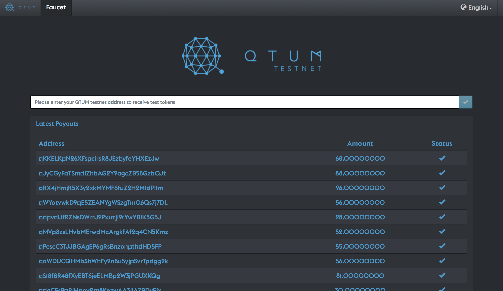
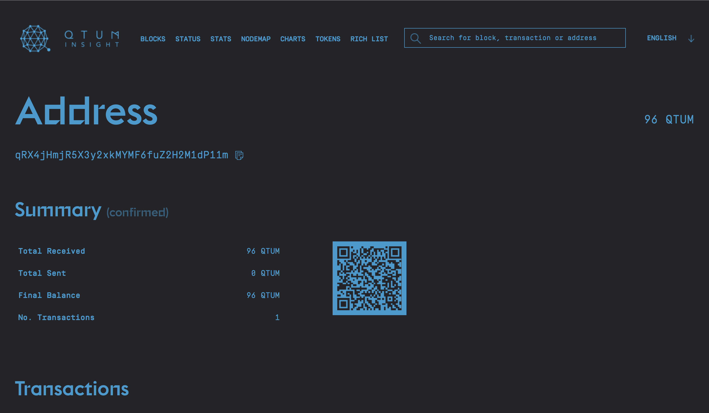
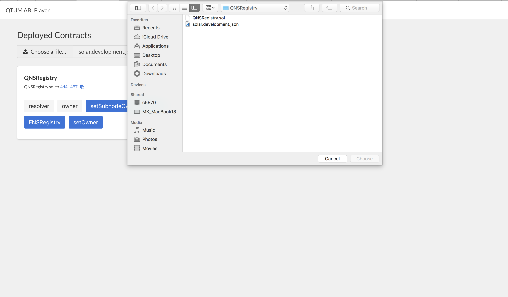

# How to start a Qtum node and deploy contract on it

## From zero to hero


## Requirements:

OS: MacOS

Docker

Qtum-CLI

## Setup Envirement

Let’s using Docker image to start a Qtum node:
Pull the latest image version

`$ docker pull hayeah/qtumportal:latest`

Now we can using the latest image version start a node ( testnet )

```
$ docker run -it --rm \
--name myapp \
-e "QTUM_NETWORK=testnet" \
-v `pwd`:/dapp \
-p 9899:9899 \
-p 9888:9888 \
-p 3889:3889 \
-p 13888:13888 \
hayeah/qtumportal`

As soon as we start a node, our log will looks like this

`03:43:22  qtumd | Starting qtumd on port 5000
03:43:22 portal | Starting portal on port 5001
03:43:22 portal | time="2018-09-04T03:43:22Z" level=info msg="DApp service listening 0.0.0.0:9888"
03:43:22 portal | time="2018-09-04T03:43:22Z" level=info msg="Auth service listening 0.0.0.0:9899"
03:43:23  qtumd | 2018-09-04 03:43:23
03:43:23  qtumd | 2018-09-04 03:43:23 Qtum version mainnet-ignition-v0.15.2
03:43:23  qtumd | 2018-09-04 03:43:23 InitParameterInteraction: parameter interaction: -whitelistforcerelay=1 -> setting -whitelistrelay=1
```

Take a look of our docker

```
$ docker ps`

`CONTAINER ID        IMAGE               COMMAND                  CREATED             STATUS              PORTS                                                                                                        NAMES
a33867ebe8a3        hayeah/qtumportal   "/bin/sh -c 'mkdir -…"   42 seconds ago      Up 42 seconds       0.0.0.0:3889->3889/tcp, 0.0.0.0:9888->9888/tcp, 0.0.0.0:9899->9899/tcp, 3888/tcp, 0.0.0.0:13888->13888/tcp   myapp
```
Our NAMES is “myapp” using exec -it
`$docker exec -it myapp sh`

`/dapp #`

Now we can use qcli to operate

```
/dapp # qcli getinfo
{
"deprecation-warning": "WARNING: getinfo is deprecated and will be fully removed in 0.16. Projects should transition to using getblockchaininfo, getnetworkinfo, and getwalletinfo before upgrading to 0.16",
"version": 150200,
"protocolversion": 70016,
"walletversion": 139900,
"balance": 0.00000000,
"stake": 0.00000000,
"blocks": 71371,
"timeoffset": 0,
"connections": 8,
"proxy": "",
"difficulty": {
"proof-of-work": 1.52587890625e-05,
"proof-of-stake": 1551162.284585649
},
"testnet": true,
"moneysupply": 0,
"keypoololdest": 1536032607,
"keypoolsize": 2000,
"paytxfee": 0.00000000,
"relayfee": 0.00400000,
"errors": ""
}
```

## Request Testnet Token On Qtum

Lets open a new wallet and request some testnet token first, in order to deploy a contract

```
/dapp# qcli getnewaddress
qRX4jHmjR5X3y2xkMYMF6fuZ2H2M1dP11m
```

We open a new wallet with address: “qRX4jHmjR5X3y2xkMYMF6fuZ2H2M1dP11m”
Now we can use this address to request testnet token

[Qtum testnet faucet]( http://testnet-faucet.qtum.info/#!/)





paste your address on it, and faucet will send their testnet token to you, you can only request once in 24hr.
wait for a while then you can check your balance

`/dapp# qcli getbalance`
`96.00000000`


## Using Solar Deploy contract

Qtum using Solar to deploy contract
Because all the move on blockchain need to spend token, so we chose the address with 96 tokens inside it.

`# export QTUM_SENDER=”your address here”`

Using solar to deploy contract

if success our log will look like this:

```
🚀  All contracts confirmed
deployed QNSRegistry.sol => 4d4b1c4a5111cb7c1fd469596204b841754c8497
```

We can use #solar status to see the detail of this contract

```
/dapp/qtoken/qns/QNSRegistry # solar status
✅  QNSRegistry.sol
txid: 4b0c1fc1ce8528820a3ce104263174523ac323daaa37bde252d8ca7720ee1065
address: 4d4b1c4a5111cb7c1fd469596204b841754c8497
confirmed: true
owner: qRX4jHmjR5X3y2xkMYMF6fuZ2H2M1dP11m
```

##  Abiplay Interact With Your Contract

[Abiplay](http://localhost:9899/abiplay/)

After deploy our contract with solar, solar will generate a json file name “solar.development.json” as a abi interface.

chose “solar.development.json” from abiplay


